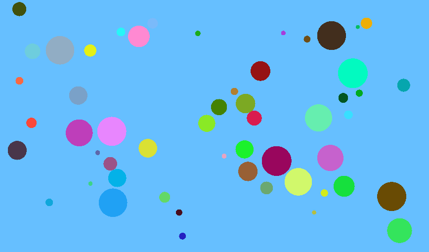

# Elastic Collisions

A simple simulation of [elastic collisions](https://en.wikipedia.org/wiki/Elastic_collision) in 2D, built with C++ and [raylib](https://www.raylib.com/).
You can check it out [live on the web](https://leotappe.github.io/elastic-collisions/) thanks to [WebAssembly](https://de.wikipedia.org/wiki/WebAssembly).



## Building

If you want to build this project yourself, you'll need

- `CMake` 3.24 or newer.
- A build tool (e.g. `make`).
- A compiler capable of C++23 (e.g. a recent version of `gcc`). 
- In case you want to build for web, `emcc`/[Emscripten](https://emscripten.org/docs/getting_started/downloads.html). Make sure the `EMSDK` environment variable is correctly set, as described in the link.

There are four CMake presets available (see `CMakePresets.json`): `release`, `debug`, `web-release`, and `web-debug`.
Pick one and replace `<name>` by it in the instructions below:

```bash
cmake --preset <name>
cmake --build --preset <name>
```

For the desktop presets (`release` and `debug`), this should produce an executable according to your OS.
For example, on linux, you should be able to run

```bash
./build/release/elastic-collisions/elastic-collisions
```

For the web presets (`web-release` and `debug`), the produced `.wasm` is not directly executable.
Instead, there should be an `index.html` in the build directory that you can serve through an HTTP server.
For example, on linux with `emrun`:

```bash
emrun build/web-release/elastic-collisions/index.html
```

## Background

The primary motivation behind this project was to figure out how easy or difficult it is to create a not-entirely-trivial graphical C++ program that can be run both on desktop for various operating systems (by compiling to corresponding machine code) and on the web (by compiling to WebAssembly), and that behaves uniformly across all these platforms.

In particular,

1. How much `html`/`js`/`css` would need to be written?
2. How much web-specific stuff would creep into the C++ code itself?
3. How difficult would the build process/setup be (`CMake` etc)?

I found the answers quite pleasant:

1. Without needing to play [code golf](https://en.wikipedia.org/wiki/Code_golf), I ended up with 14 lines of `html`, 1 line of `js`, and  7 lines of `css`. That's an amount I can tolerate. See `elastic-collisions/web` for the sauce. Of course, `emcc` generates a gigantic amount of JavaScript when compiling our code, see `docs/elastic-collisions.js`, but that's not something we have to care about.
2. There is a little bit of web-specific code and conditional compilation, but it's limited to one file (see `elastic-collisions/main.cpp`). In fact, one could avoid all of that to get even more "pure" code by linking with Emscripten's [ASYNCIFY](https://emscripten.org/docs/tools_reference/settings_reference.html#asyncify) option, but that led to noticeably less smooth behavior, and even FPS drops when the number of balls in the simulation got large. So I stuck with `emscripten_set_main_loop_arg`.
3. The most important thing here is to compile `raylib` for web, which is as easy as specifying the correct value for the `PLATFORM` variable for the configure step (see `CMakePresets.json`). Besides that, the web-specific stuff is again fairly minimal (see `elastic-collisions/CMakeLists.txt` for the details).

Overall, it's quite nice how easy it is to write a small graphical client-side web application in C++ in 2025.